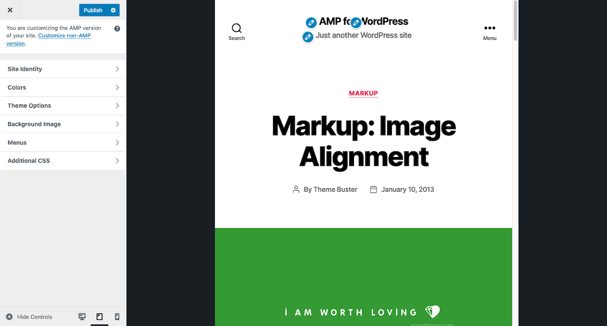
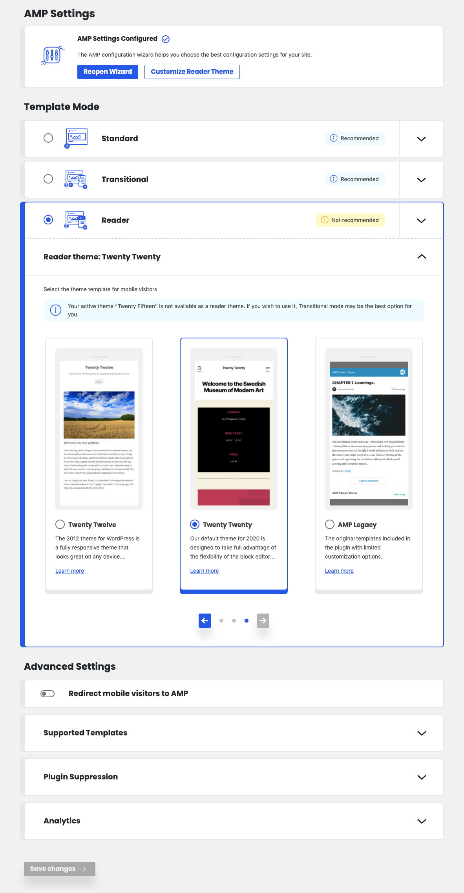

<!-- DO NOT EDIT THIS FILE; it is auto-generated from readme.txt -->
# AMP Plugin for WordPress

The Official AMP Plugin, supported by the AMP team. Formerly Accelerated Mobile Pages, AMP enables great experiences across both mobile and desktop.

**Contributors:** [google](https://profiles.wordpress.org/google), [xwp](https://profiles.wordpress.org/xwp), [automattic](https://profiles.wordpress.org/automattic), [westonruter](https://profiles.wordpress.org/westonruter), [albertomedina](https://profiles.wordpress.org/albertomedina), [schlessera](https://profiles.wordpress.org/schlessera), [swissspidy](https://profiles.wordpress.org/swissspidy), [pierlo](https://profiles.wordpress.org/pierlo), [johnwatkins0](https://profiles.wordpress.org/johnwatkins0), [joshuawold](https://profiles.wordpress.org/joshuawold), [ryankienstra](https://profiles.wordpress.org/ryankienstra)  
**Tags:** [amp](https://wordpress.org/plugins/tags/amp), [mobile](https://wordpress.org/plugins/tags/mobile), [optimization](https://wordpress.org/plugins/tags/optimization), [accelerated mobile pages](https://wordpress.org/plugins/tags/accelerated-mobile-pages), [framework](https://wordpress.org/plugins/tags/framework), [components](https://wordpress.org/plugins/tags/components), [blocks](https://wordpress.org/plugins/tags/blocks), [performance](https://wordpress.org/plugins/tags/performance), [ux](https://wordpress.org/plugins/tags/ux), [seo](https://wordpress.org/plugins/tags/seo), [official](https://wordpress.org/plugins/tags/official)  
**Requires at least:** 4.9  
**Tested up to:** 5.5  
**Stable tag:** 1.5.5  
**License:** [GPLv2 or later](http://www.gnu.org/licenses/gpl-2.0.html)  
**Requires PHP:** 5.6  

   

## Description ##

**The Official AMP Plugin** enables AMP content publishing with WordPress in a way that is fully and seamlessly integrated with the standard mechanisms of the platform. The key features are the following:

1. **Automate the process of generating AMP-valid markup as much as possible**, letting users follow the standard workflows they are used to in WordPress.
2. **Provide effective validation tools** to help users deal with AMP incompatibilities when they happen, including mechanisms for **identifying**, **contextualizing**, and **resolving issues caused by validation errors**.
3. **Provide development support** to make it easier for WordPress developers to build AMP-compatible ecosystem components and build websites and solutions with AMP-compatibility built in.
4. **Support the serving of AMP pages** to make it easier for site owners to take advantage of mobile redirection, AMP-to-AMP linking, no serving of invalid AMP pages, and generation of optimized AMP (e.g. AMP optimizer) by default.
5. **Provide a turnkey solution** for segments of WordPress creators to be able to go from zero to publishing AMP pages in no time, regardless of technical expertise or availability of resources.

The Official AMP Plugin for WordPress is a powerful tool that helps you build user-first WordPress sites, that is, sites that are fast, beautiful, secure, engaging, and accessible. A user-first site will deliver experiences that delight your users and therefore will increase user engagement and the success of your site. And, contrary to the popular belief of being only for mobile sites (it doesn&#39;t stand for Accelerated _Mobile_ Pages anymore!), AMP is a fully responsive web component framework, which means that you can provide AMP experiences for your users on both mobile and desktop platforms.

## AMP Plugin Audience: Everyone

This plugin can be used by both developers and non-developer users:

- If you are a developer or tech savvy user, you can take advantage of advanced developer tools provided by the AMP plugin to fix any validation issues your site may have and reach full AMP compatibility.
- If you are not a developer or tech savvy user, or you just simply don&#39;t want to deal with validation issues and tackling development tasks, the AMP plugin allows you to assemble fully AMP-compatible sites with different configurations taking advantage of AMP compatible components, and helping you to cope with validation issues by removing offending markup in cases where it is possible, or suppressing all together the execution of any AMP-incompatible plugin in the context of AMP pages.

The bottom line is that regardless of your technical expertise, The Official AMP Plugin can be useful to you.

## Template Modes

The Official AMP Plugin enables site owners to serve AMP to their users in different ways, which are referred to as template modes: Standard, Transitional, and Reader. The differences between them are in terms of the number of themes used (i.e. one or two), and the number of versions of the site (non-AMP, AMP). Each template mode brings its own value proposition and serves the needs of different scenarios in the large and diverse WordPress ecosystem. And in all cases, the AMP plugin provides as much support as possible in terms of automating the generation of AMP content, as well as keeping the option chosen AMP valid. In a nutshell, the available template modes are the following:

**Standard Mode**: This template mode is the ideal, as there is only one theme for serving requests and a single version of your site: the AMP version. Besides enabling all of your site to be AMP-first, this has the added benefit of reducing development and maintenance costs. This mode is the best choice for sites where the theme and plugins used in the site are fully AMP-compatible. It&#39;s also a good option if some components are not AMP-compatible but the site owner has the resources or the know-how to fix them.

**Transitional Mode**: In this mode there is also a single theme used, but there can be two versions of each page: AMP, non-AMP. The active theme is used for serving the AMP and non-AMP versions of a given URL. This mode is a good choice if the site uses a theme that is not fully AMP compatible, but the functional differences between the AMP and non-AMP are acceptable (due to graceful degradation). In this case users accessing the site from mobile devices can get the AMP version and get an optimized experience which also retains the look and feel of the non-AMP version .

**Reader Mode**: In this mode there are two different themes, one for AMP and another for non-AMP content, and therefore there are also two versions of the site. This mode may be selected when the site is using an AMP-incompatible theme, but the level of incompatibilities is significant without graceful degradation. It&#39;s also a good choice if you are not technically savvy (or simply do not want to deal with the incompatibilities) and therefore want simplified and robust workflows that allow you to take advantage of AMP with minimal effort.

Different modes would be recommended in different scenarios, depending on the specifics of your site and your role. As you configure the plugin, it will suggest the mode that might be best for you based on its assessment of the theme and plugins used on your site. And, independently of the mode used, you have the option of serve all, or only a portion of your site as AMP. This gives you all the flexibility you need to get started enabling AMP in your site progressively.

## AMP Ecosystem

It is possible today to assemble great looking user-first sites powered by the AMP plugin by picking and choosing themes and plugins from a growing AMP-compatible ecosystem. In this context, the AMP plugin acts as an orchestrator of the overall AMP content creation and publishing process; it serves as a validator and enforcer making it easier to not only to get to AMP experiences, but to stay in them with confidence.

Many popular theme and plugin developers have taken efforts to support The Official AMP Plugin. If you are using a theme like Astra, Newspack or plugins like Yoast, WP Forms — they will work out of the box! You can see the growing list of tested themes and plugins [here].

## AMP Development

Although there is a growing ecosystem of AMP compatible WordPress components, still there are some ways to go before 100% AMP compatibility in the ecosystem. If you are a developer, or you have the resources to pursue development projects, you may want, in some cases, develop custom functionality (i.e. as a plugin, or in the theme space) to serve your specific needs. The Official AMP Plugin can be of great help to you by providing powerful and effective developer tools that shed light into the AMP development process as it is done in WordPress, including mechanisms for detailing the root causes of all validation issues, and the contextual space to understand them properly, and dealing with them during the process of achieving full AMP compatibility.

## Frequently Asked Questions ##

Please see the [FAQs on amp-wp.org](https://amp-wp.org/documentation/frequently-asked-questions/). Don&#39;t see an answer to your question? Please [search the support forum](https://wordpress.org/support/plugin/amp/) to see if someone has asked your question. Otherwise, please [open a new support topic](https://wordpress.org/support/plugin/amp/#new-post).

## Installation ##

1. Upload the folder to the `/wp-content/plugins/` directory.
2. Activate the plugin through the &#39;Plugins&#39; menu in WordPress.
3. If you currently use older versions of the plugin in `Reader` mode, it is strongly encouraged to migrate to `Transitional` or `Standard` mode. Depending on your theme/plugins, some development work may be required.

## Getting Started ##

To learn more about the plugin and start leveraging its capabilities to power your AMP content creation workflow check [The Official AMP Plugin product site](https://amp-wp.org/).

If you are a developer, we encourage you to [follow along](https://github.com/ampproject/amp-wp) or [contribute](https://github.com/ampproject/amp-wp/blob/develop/contributing.md) to the development of this plugin on GitHub.

We have put up a comprehensive FAQ page and extensive documentation to help you start as smoothly as possible.

But if you need some help, we are right here to support you on this plugin&#39;s forum section, as well as through Github issues. And yep, our thriving AMPExpert ecosystem has indie freelancers to enterprise grade agencies in case you need commercial support!

## Screenshots ##

### In the website experience, theme support enables you to reuse the active theme's templates and stylesheets; all WordPress features (menus, widgets, comments) are available in AMP.

### All core themes are supported, and many themes can be served as AMP with minimal changes, Otherwise, behavior is often as if JavaScript is turned off in the browser since scripts are removed.

### Reader mode templates are still available, but they differ from the active theme.

### Switch from Reader mode to Transitional or Standard mode in AMP settings screen.

### Standard mode: Using AMP as the framework for your site, not having to maintain an AMP and non-AMP version. Mobile and desktop users get same experience.

### Transitional mode: A path to making your site fully AMP-compatible, with tools to assist with debugging validation issues along the way.

### Make the entire site available in AMP or pick specific post types and templates; you can also opt-out on per-post basis.

### Plugin checks for AMP validity and will indicate when: no issues are found, new issues need review, or issues block AMP from being served.

### The editor will surface validation issues during content authoring. The specific blocks with validation errors are indicated.

### Each Validated URL shows the list of validation errors encountered, giving control over whether invalid markup is removed or kept. Keeping invalid markup disables AMP.

### Each validation error provides a stack trace to identify which code is responsible for the invalid markup, whether a theme, plugin, embed, content block, and so on.

### Styles added by themes and plugins are automatically concatenated, minified, and tree-shaken to try to keep the total under 75KB of inline CSS.

### A WP-CLI command is provided to check the URLs on a site for AMP validity. Results are available in the admin for inspection.

## Changelog ##

For the plugin’s changelog, please see [the Releases page on GitHub](https://github.com/ampproject/amp-wp/releases).

