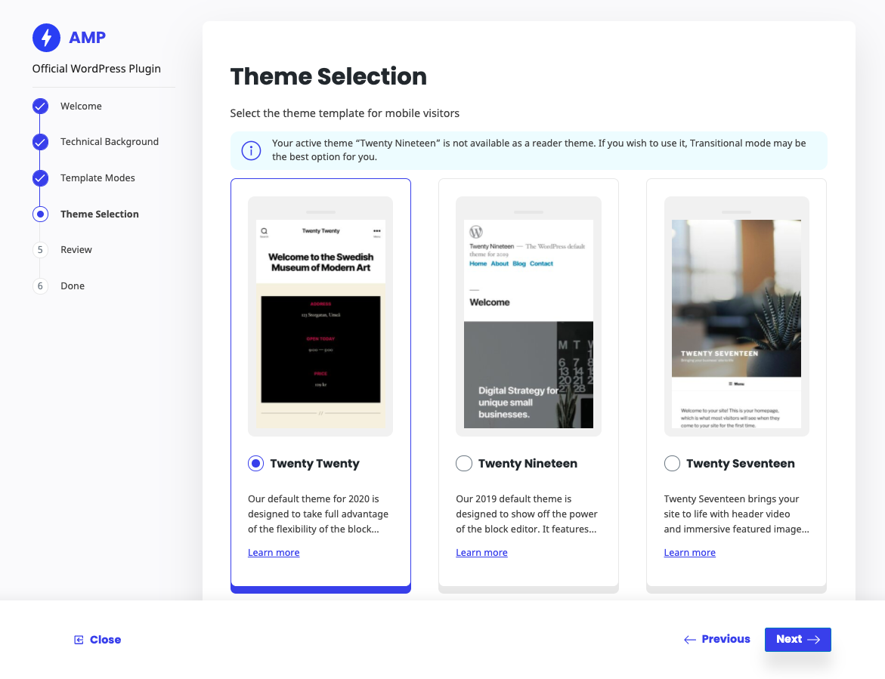

<!-- DO NOT EDIT THIS FILE; it is auto-generated from readme.txt -->
# AMP Plugin for WordPress

The Official AMP plugin, supported by the AMP team. Formerly Accelerated Mobile Pages, AMP enables great experiences across both mobile and desktop.

**Contributors:** [google](https://profiles.wordpress.org/google), [xwp](https://profiles.wordpress.org/xwp), [automattic](https://profiles.wordpress.org/automattic), [westonruter](https://profiles.wordpress.org/westonruter), [albertomedina](https://profiles.wordpress.org/albertomedina), [schlessera](https://profiles.wordpress.org/schlessera), [swissspidy](https://profiles.wordpress.org/swissspidy), [pierlo](https://profiles.wordpress.org/pierlo), [johnwatkins0](https://profiles.wordpress.org/johnwatkins0), [joshuawold](https://profiles.wordpress.org/joshuawold), [ryankienstra](https://profiles.wordpress.org/ryankienstra)  
**Tags:** [amp](https://wordpress.org/plugins/tags/amp), [mobile](https://wordpress.org/plugins/tags/mobile), [optimization](https://wordpress.org/plugins/tags/optimization), [accelerated mobile pages](https://wordpress.org/plugins/tags/accelerated-mobile-pages), [framework](https://wordpress.org/plugins/tags/framework), [components](https://wordpress.org/plugins/tags/components), [blocks](https://wordpress.org/plugins/tags/blocks), [performance](https://wordpress.org/plugins/tags/performance), [ux](https://wordpress.org/plugins/tags/ux), [seo](https://wordpress.org/plugins/tags/seo), [official](https://wordpress.org/plugins/tags/official)  
**Requires at least:** 4.9  
**Tested up to:** 5.5  
**Stable tag:** 1.5.5  
**License:** [GPLv2 or later](http://www.gnu.org/licenses/gpl-2.0.html)  
**Requires PHP:** 5.6  

   

## Screenshots ##

### In the website experience, theme support enables you to reuse the active theme's templates and stylesheets; all WordPress features (menus, widgets, comments) are available in AMP.

### All core themes are supported, and many themes can be served as AMP with minimal changes, Otherwise, behavior is often as if JavaScript is turned off in the browser since scripts are removed.

### Reader mode templates are still available, but they differ from the active theme.

### Switch from Reader mode to Transitional or Standard mode in AMP settings screen.

### Standard mode: Using AMP as the framework for your site, not having to maintain an AMP and non-AMP version. Mobile and desktop users get same experience.

### Transitional mode: A path to making your site fully AMP-compatible, with tools to assist with debugging validation issues along the way.

### Make the entire site available in AMP or pick specific post types and templates; you can also opt-out on per-post basis.

### Plugin checks for AMP validity and will indicate when: no issues are found, new issues need review, or issues block AMP from being served.

### The editor will surface validation issues during content authoring. The specific blocks with validation errors are indicated.

### Each Validated URL shows the list of validation errors encountered, giving control over whether invalid markup is removed or kept. Keeping invalid markup disables AMP.

### Each validation error provides a stack trace to identify which code is responsible for the invalid markup, whether a theme, plugin, embed, content block, and so on.

### Styles added by themes and plugins are automatically concatenated, minified, and tree-shaken to try to keep the total under 75KB of inline CSS.

### A WP-CLI command is provided to check the URLs on a site for AMP validity. Results are available in the admin for inspection.

## Changelog ##

For the plugin’s changelog, please see [the Releases page on GitHub](https://github.com/ampproject/amp-wp/releases).

